<div align="center">

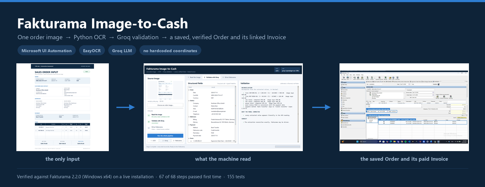

<p><b>Drop in a picture of a sales order. Get a saved, verified Order and its linked, paid
Invoice inside Fakturama &mdash; created by driving the real user interface, not by writing
to the database.</b></p>

<p>


</p>

</div>

---

<div align="center">

<h3>The whole thing, in eleven seconds</h3>

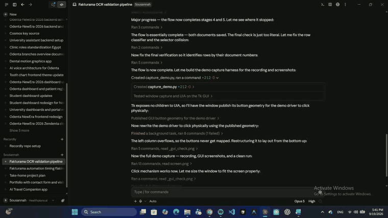

<p><em>A time-lapse of one real run. The full 90-second recording is
<a href="docs/recording/fakturama-image-to-cash-short.mp4">docs/recording/fakturama-image-to-cash-short.mp4</a>.</em></p>

</div>

---

## Contents

| | |
|---|---|
| ✅ [Deliverables](#-deliverables) | what the brief asked for, and where each one is |
| 🎯 [What it does](#-what-it-does) | the pipeline in one picture |
| 🚀 [Quick start](#-quick-start) | install, configure, check, run — five steps |
| 🖥️ [Using the GUI](#️-using-the-gui) | the three panels, with screenshots |
| ⌨️ [Using the CLI](#️-using-the-cli-no-gui) | every command, with real output |
| 📸 [What one run produces](#-what-one-run-produces) | the evidence it leaves behind |
| 🧠 [How it works](#-how-it-works) | extraction, grounding, verification |
| 🔁 [Repeatable runs](#-repeatable-runs) | resetting the workspace between runs |
| 🩺 [Troubleshooting](#-troubleshooting) | what to do when something goes wrong |
| 🗂️ [Project layout](#️-project-layout) | where everything lives |
| ⚠️ [Known gaps](#️-known-gaps) | what is honestly not right yet |

---

## ✅ Deliverables

| | Deliverable | Where it is |
|---|---|---|
| ✔ | **Source code with a clear structure in a Git repo** | This repository — `src/f2c/` split into `extract` / `gui` / `ui` / `flow` / `verify`, plus `tests/` and `scripts/`. See [project layout](#️-project-layout). |
| ✔ | **Setup instructions: dependencies and how to run the automation against Fakturama** | [Quick start](#-quick-start), and `f2c doctor` checks the whole environment before you run anything. |
| ✔ | **Annotated screenshots or a short recording** | **Both.** 23 annotated step figures in [`docs/screenshots/run/`](docs/screenshots/run) and collected into `Fakturama_Annotated_Screenshots.docx`; a 90-second recording in [`docs/recording/`](docs/recording). |
| ✔ | **README** | This file. |

Two further documents are generated from the repository and from a run report, so their
figures cannot drift from what the code actually did:

> **Written question — *"If you had 3 more hours, what would you do?"*** → [answered at the end](#-if-i-had-3-more-hours).

---

## 🎯 What it does

One image goes in. Master data, an Order and a linked Invoice come out — each created only when it
does not already exist, each verified before the next step starts.

<div align="center">
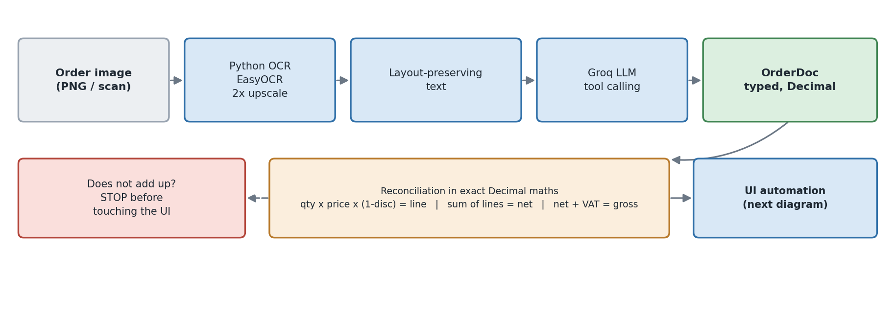
</div>

<table>
<tr>
<td width="50%" valign="top">

<b>Extraction</b>
<ol>
<li>Python <b>OCR</b> reads the pixels (EasyOCR, upscaled 2&times;)</li>
<li>The reading is re-rendered with its <b>column positions preserved</b></li>
<li>A <b>Groq</b> text model structures it under a tool schema</li>
<li>Every total is <b>recomputed in <code>Decimal</code></b> &mdash; if the document's own
arithmetic disagrees, nothing is typed anywhere</li>
</ol>

</td>
<td width="50%" valign="top">

<b>Automation</b>
<ol>
<li>Open a <b>New Order</b> and keep it open for the whole run</li>
<li>Resolve or create the <b>Debtor</b>, its <b>payment method</b>, each <b>VAT rate</b> and
each <b>Product</b></li>
<li>Complete every <b>item line</b> and save the Order once</li>
<li>Create the <b>Invoice from the Order's follow-up area</b>, apply the paid status, and
<b>verify both documents</b></li>
</ol>

</td>
</tr>
</table>

**Status: the complete flow runs end to end.** The recorded run passed **67 of 68 steps on the first
attempt, with zero retries**. The one non-`ok` step is a documented deviation, not a failure.

| Spec stage | What it covers | Result |
|---|---|:---:|
| **1** (1.1–1.8) | Extract the image, open New Order, fill the header | ✅ |
| **2** (2.1–2.13) | Select or create the Debtor, including the payment method | ✅ |
| **3** (3.1–3.17) | VAT + Product create/select, and every item line | ✅ |
| **4** (4.1–4.7) | Confirm, save and verify the Order; follow-up Invoice | ✅ |
| **5** (5.1–5.7) | Linked Invoice, paid status, final verification | ✅ |

One run against a pristine workspace creates, in this order:

```text
PAYMENT   Bank Transfer            code = Credit transfer          (spec 2.10.4)
VAT       VAT 19%                  value = 19%   code = S (Standard rate)
CONTACT   Northstar Office GmbH    Marta Klein   alias NORTHSTAR-BERLIN
PRODUCT   CHR-ERG-01               gross 297.50  = 250.00 x (1 + 19/100)   (spec 3.9)
PRODUCT   MAT-DESK-02              gross  47.60  =  40.00 x (1 + 19/100)
ORDER     PO000001                 Cust.Ref. WEB-2026-0714-A17   net 570.00 / gross 678.30
INVOICE   INV000001                linked to the Order, paid 2026-07-18, value 678.30
```

The 10% transaction-line discount is correctly **not** applied to the product master price —
that is the spec 3.9 rule, and the automation does the arithmetic itself.

---

## 🚀 Quick start

### Step 1 — Prerequisites

| | Needed | Notes |
|---|---|---|
| 🪟 | **Windows 10 or 11** | The automation uses Microsoft UI Automation, so it is Windows-only. |
| 🐍 | **Python 3.9 or newer** | `python --version` |
| 🧾 | **Fakturama 2.x** | Download from [fakturama.info/download](https://www.fakturama.info/download/) and run it once so it creates its workspace. |
| 🔑 | **A Groq API key** | Free at [console.groq.com](https://console.groq.com). Used only for the text model that structures the OCR reading. |

### Step 2 — Install

```bash
git clone <this-repo> fakturama-image-to-cash
cd fakturama-image-to-cash

python -m venv .venv
```

Activate the virtual environment for your shell:

| Shell | Command |
|---|---|
| **PowerShell** | `.\.venv\Scripts\Activate.ps1` |
| **cmd.exe** | `.venv\Scripts\activate.bat` |
| **Git Bash** | `source .venv/Scripts/activate` |

Then:

```bash
pip install -r requirements.txt
pip install -e .            # optional, but gives you the short `f2c` command
```

> ⏳ The **first OCR run downloads the EasyOCR models (~100 MB)** and takes a minute. Every run after
> that is instant. If you would rather use Tesseract, put its binary on `PATH`, `pip install pytesseract`,
> and set `F2C_OCR_ENGINE=tesseract`.

### Step 3 — Configure

Copy the example file and edit it:

| Shell | Command |
|---|---|
| **PowerShell** | `Copy-Item .env.example .env` |
| **cmd.exe** | `copy .env.example .env` |
| **Git Bash** | `cp .env.example .env` |

```ini
# .env
F2C_PROVIDER=groq
GROQ_API_KEY=gsk_...
F2C_MODEL=openai/gpt-oss-120b

F2C_FAKTURAMA_EXE=D:\Fakturama2\Fakturama.exe
F2C_WORKSPACE=D:\
```

> 📁 **`F2C_WORKSPACE` is not the install directory.** It is the folder Fakturama's own title bar names —
> if the title bar reads `Fakturama - D:\`, then the workspace is `D:\`. It is the folder that contains
> `Database/` and `Templates/`.

<details>
<summary><b>Every setting you can put in <code>.env</code></b></summary>

| Variable | Default | What it does |
|---|---|---|
| `F2C_PROVIDER` | `groq` | `groq` or `anthropic`. |
| `GROQ_API_KEY` | — | Required when the provider is `groq`. |
| `ANTHROPIC_API_KEY` | — | Required when the provider is `anthropic`. |
| `F2C_MODEL` | `openai/gpt-oss-120b` | The model that structures the OCR reading. |
| `F2C_EXTRACTION_MODE` | `ocr` | `ocr` reads with Python OCR then structures the text; `vision` hands the image straight to a multimodal model. |
| `F2C_OCR_ENGINE` | `auto` | `auto`, `easyocr` or `tesseract`. |
| `F2C_FAKTURAMA_EXE` | — | Absolute path to `Fakturama.exe`. |
| `F2C_WORKSPACE` | `~/Fakturama2` | The folder holding `Database/` and `Templates/`. |

</details>

### Step 4 — Check the environment

```bash
f2c doctor
```

This is worth running before the first automation run — it catches a missing dependency, a wrong
executable path or a broken selector file in two seconds instead of five minutes in.

```text
python           3.9.13
  ok   pydantic       models
  ok   uiautomation   UI automation (required to drive Fakturama)
  ok   requests       Groq chat-completions
  ok   easyocr        OCR - the primary engine
  ok   tkinter        the desktop front end
  ...
executable       D:\Fakturama2\Fakturama.exe
workspace        D:\
database         D:\Database\Database.script
selectors        115 logical controls, 235 strategies

ready
```

### Step 5 — Run it

> 🖱️ **The automation drives the mouse and keyboard.** It brings Fakturama to the foreground and
> types into it for roughly 15 minutes. Start it when you can leave the machine alone.

<table>
<tr>
<th width="50%">Option A &mdash; with the GUI &#128421;&#65039;</th>
<th width="50%">Option B &mdash; without the GUI &#9000;&#65039;</th>
</tr>
<tr>
<td valign="top">

<pre><code>python run_gui.py</code></pre>

<p>A window opens. Choose an image, then press <b>Run the whole pipeline</b> &mdash; or step
through the three stages one at a time and read each result before continuing.</p>

<p><a href="#%EF%B8%8F-using-the-gui">&rarr; full GUI guide</a></p>

</td>
<td valign="top">

<pre><code>f2c run --image fixtures/sample_order.png</code></pre>

<p>Runs the same pipeline headlessly, printing each step as it happens and writing a full
report to <code>out/run-&lt;timestamp&gt;/</code>.</p>

<p><a href="#%EF%B8%8F-using-the-cli-no-gui">&rarr; full CLI guide</a></p>

</td>
</tr>
</table>

---

## 🖥️ Using the GUI

```bash
python run_gui.py                                   # works without `pip install -e .`
python run_gui.py path\to\your_order.png            # pre-load an image
f2c gui                                             # same window, after `pip install -e .`
```

The window shows the pipeline's three stages in the order they actually run. Nothing is typed into
Fakturama until the extraction reconciles — **if the document's own arithmetic disagrees, stage 3
stays disabled.**

<div align="center">
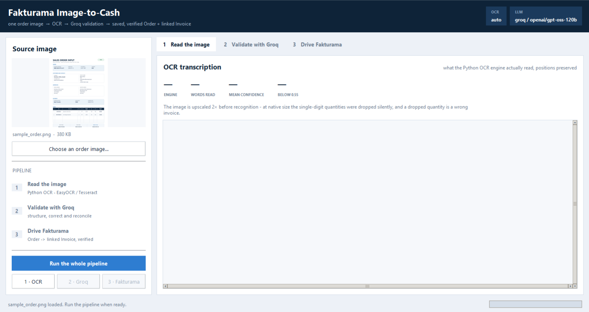
<br><em>The window when it opens: the source image on the left, the pipeline below it, and the three
stages waiting on the right.</em>
</div>

<br>

<div align="center">
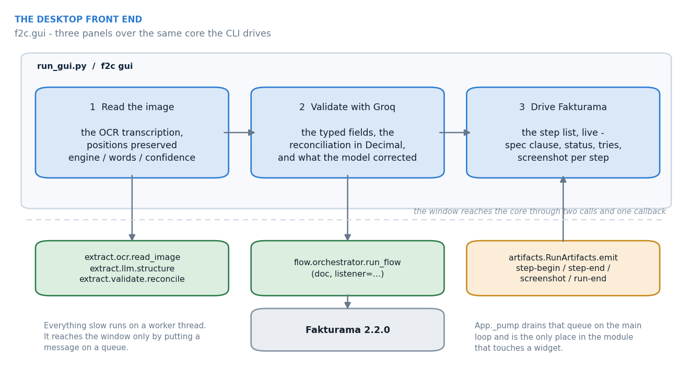
</div>

### 1 · Read the image

Press **1 · OCR**. Python OCR reads the pixels and the panel shows the transcription *exactly as the
model will see it* — with the horizontal positions preserved, so the item table is still a table.

<div align="center">
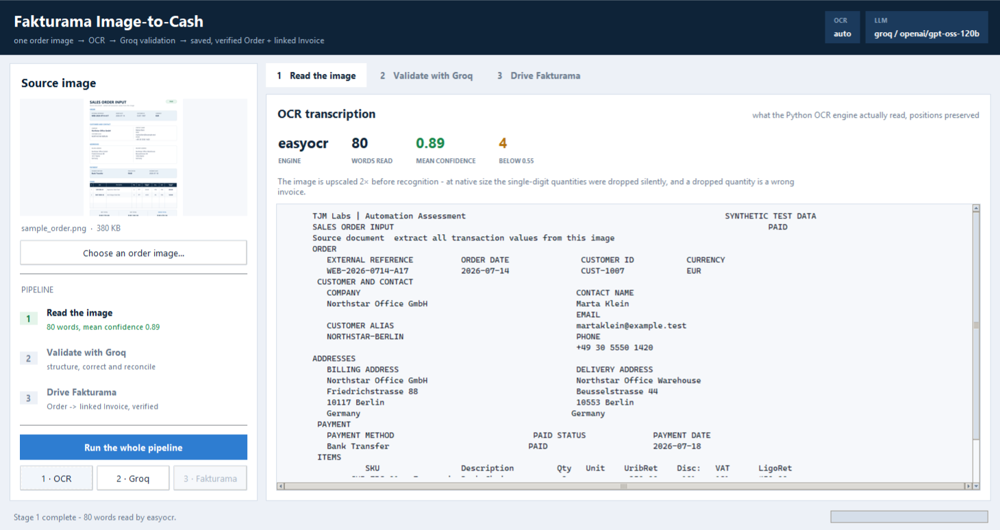
</div>

The strip at the top gives the engine, how many words were read, the mean confidence and how many
words fell below 0.55. **This is the ground truth the language model is given** — so if a value comes
out wrong later, this panel tells you whether the pixels or the model were at fault.

### 2 · Validate with Groq

Press **2 · Groq**. The transcription goes to the model under a tool schema, and the result is
reconciled in `Decimal`.

<div align="center">
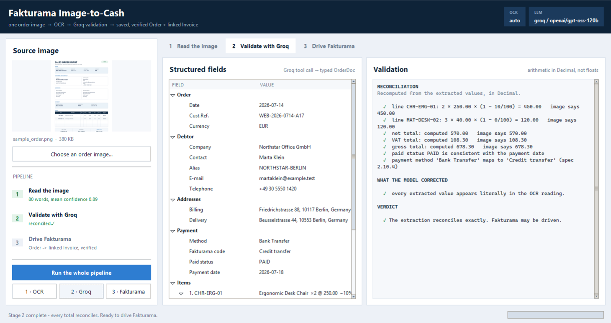
</div>

| Left | Right |
|---|---|
| The structured fields, typed — order, debtor, addresses, payment, items with their computed line totals and the spec 3.9 product gross price. | The arithmetic recomputed line by line, the paid-status consistency rule, the payment-code mapping — and **what the model corrected**: the values that do not appear in the OCR reading character for character. |

> 💡 **Why the corrections list matters.** It is the honest version of a "validated" badge. A value the
> model repaired is also a value the model *could* have fabricated, so it is listed rather than
> absorbed. On the sample document the list is empty — the model added nothing at all.

### 3 · Drive Fakturama

Press **3 · Fakturama**. The five-stage flow runs against the live application and the step list
fills in as it goes — Fakturama takes the foreground and the automation drives it:

<div align="center">
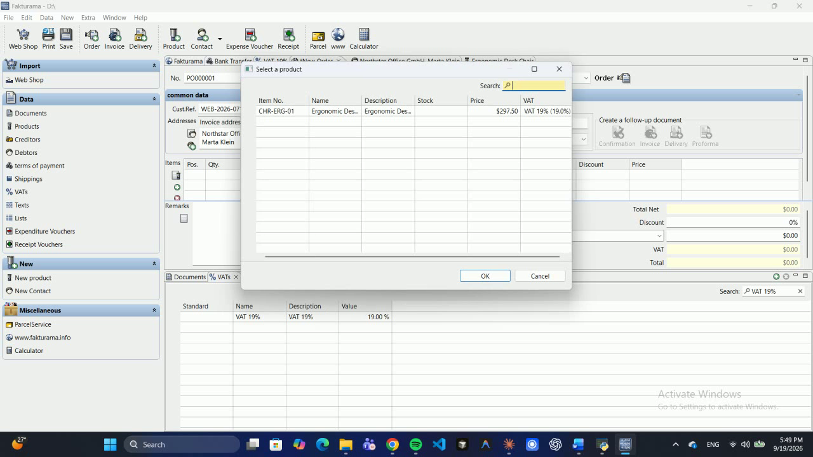
<br><em>Mid-run. The Order <code>PO000001</code> is open and stays open; the Product picker has been
re-opened after the creation detour and now offers <code>CHR-ERG-01</code> at the gross price the
automation calculated — <code>250.00 × (1 + 19/100) = 297.50</code> — against the <code>VAT 19%</code>
rate it created a few steps earlier.</em>
</div>

<br>

When it finishes, the window has the whole run:

<div align="center">
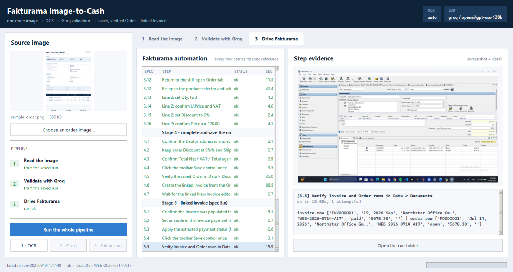
</div>

Every row carries **its clause of the written procedure**, its status, how many attempts it needed and
its duration. Click a row to see that step's screenshot and detail on the right — in the shot above,
step 5.5 is selected, and its evidence is the Documents list holding both the paid Invoice and the
still-open source Order.

### Reviewing a finished run later

A run takes about fifteen minutes and its report is what you actually want to look at afterwards. You
can reopen one without repeating it:

```bash
python run_gui.py --report out/run-20260919-174148/report.json
f2c gui --report out/run-20260919-174148/report.json
```

---

## ⌨️ Using the CLI (no GUI)

After `pip install -e .` the command is `f2c`. Without it, use `python -m f2c.cli` with `src` on the
path:

| Shell | Prefix |
|---|---|
| **PowerShell** | `$env:PYTHONPATH="src"; python -m f2c.cli ...` |
| **cmd.exe** | `set PYTHONPATH=src && python -m f2c.cli ...` |
| **Git Bash** | `PYTHONPATH=src python -m f2c.cli ...` |

### The commands

| Command | What it does | Touches Fakturama? |
|---|---|:---:|
| `f2c doctor` | Check dependencies, the executable, the workspace, the selector registry | no |
| `f2c extract` | Image → OCR → LLM → validated `OrderDoc`, printed | no |
| `f2c run` | **The full flow**: image → saved Order + linked Invoice | yes |
| `f2c verify` | Re-check an already-completed run without repeating it | reads only |
| `f2c inspect` | Dump the live UIA tree — the calibration tool for `selectors.yaml` | reads only |
| `f2c resolve <name>` | Resolve one logical control and report which tier found it | reads only |
| `f2c capture-icon` | Save a screenshot so an icon template can be cropped from it | reads only |
| `f2c gui` | Open the desktop window | — |

### Extract only — no UI, no risk

The fastest way to see the pipeline working. It never opens a window:

```bash
f2c extract --image fixtures/sample_order.png
```

```text
Order        WEB-2026-0714-A17   date 2026-07-14
Debtor       Northstar Office GmbH / Marta Klein  (alias NORTHSTAR-BERLIN)
Billing      Friedrichstrasse 88, 10117 Berlin, Germany
Delivery     Beusselstrasse 44, 10553 Berlin, Germany
Payment      Bank Transfer -> code 'Credit transfer' | PAID on 2026-07-18
Items:
  1. CHR-ERG-01     Ergonomic Desk Chair    qty 2 x 250.00  -10%  VAT 19%  = 450.00   (product gross 297.50)
  2. MAT-DESK-02    Anti-Fatigue Desk Mat   qty 3 x 40.00   -0%   VAT 19%  = 120.00   (product gross 47.60)
Totals       net 570.00 | VAT 108.30 | gross 678.30
```

Useful options: `--out order.json` to save the result, `--no-cache` to force a fresh read,
`--lenient` to report reconciliation problems instead of stopping, `--ocr-check` to assert that every
extracted value appears in the OCR text.

### The full run

```bash
f2c run --image fixtures/sample_order.png --verify-db
```

| Option | What it is for |
|---|---|
| `--image PATH` | The order image. Defaults to `fixtures/sample_order.png`. |
| `--dry-run` | Resolve every control and log what *would* be clicked, without writing anything. **The safest way to try it the first time.** |
| `--no-launch` | Attach to a Fakturama that is already running instead of starting one. |
| `--stop-after 2` | Stop cleanly after a stage (`1`–`5`). |
| `--verify-db` | After the run, read the records back out of Fakturama's stored data. |
| `--from-json PATH` | Skip extraction and reuse a saved one. |
| `--ocr-check` | Cross-check every extracted value against the OCR text. |
| `-v` / `--verbose` | Per-control debug logging. |

### Verify a finished run

```bash
f2c verify --image fixtures/sample_order.png --database
```

Re-opens Data ▸ Documents, confirms the Order and Invoice rows, and — with `--database` — reads the
persisted records straight out of Fakturama's own data files.

---

## 📸 What one run produces

Every run writes its own evidence folder:

```text
out/run-20260919-174148/
├── report.md               every step: spec clause, status, tries, seconds, screenshot
├── report.json             the same, machine-readable, plus tier stats and flow state
├── screenshots/            numbered in execution order
│   ├── 01-00-before.png
│   ├── 19-4-5-verify-the-saved-order-in-data-documents.png
│   └── ...
├── tree-<failure>.txt      a UIA tree dump, if something went wrong
└── <failure>-traceback.txt
```

`scripts/build_screenshot_guide.py` turns that folder into **23 annotated figures** — each one
captioned with the clause of the procedure it satisfies, and ringed where it matters:

<div align="center">
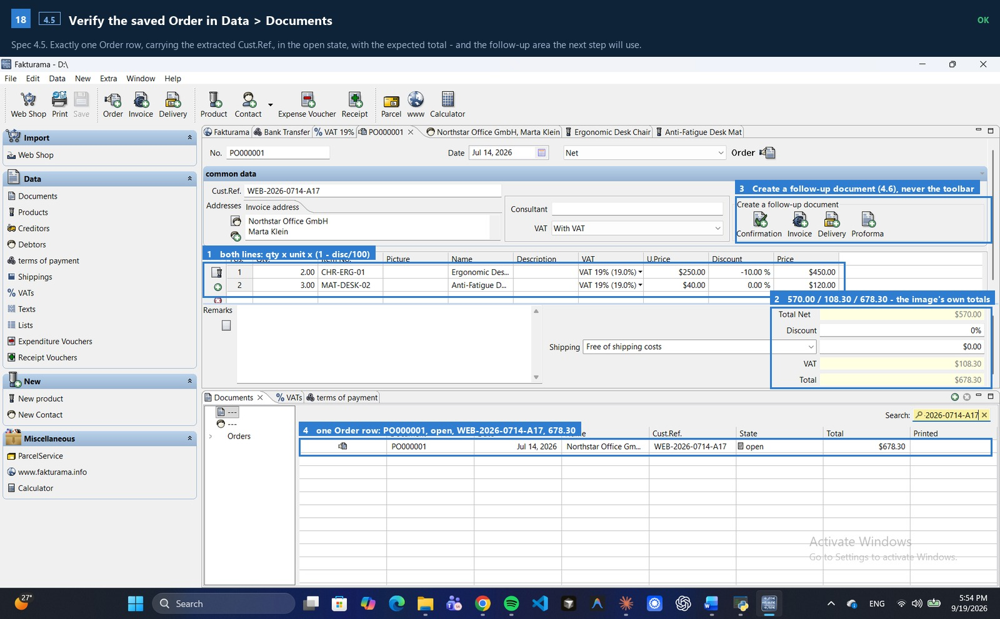 Documents" width="94%">
<br><em>Spec 4.5 — both item lines, the footer totals matched against the image, the follow-up area
the next step will use, and exactly one Order row with the extracted Cust.Ref.</em>
</div>

<br>

<div align="center">
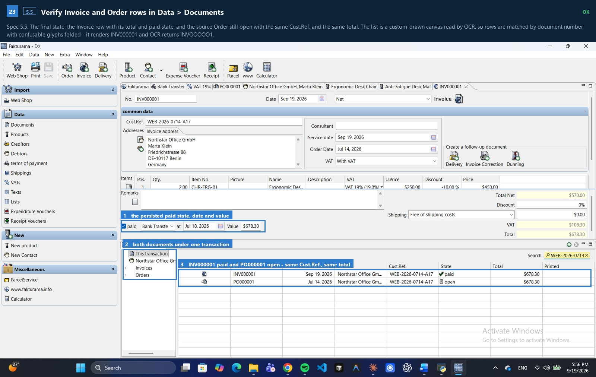
<br><em>Spec 5.5 — the persisted paid state, and both documents under one transaction: INV000001 paid
and PO000001 open, same Cust.Ref., same total.</em>
</div>

<br>

All 23 are in [`docs/screenshots/run/`](docs/screenshots/run). Regenerate them, and the Word documents,
with:

```bash
python scripts/capture_demo.py           # run the demo, record it, capture the screens
python scripts/build_screenshot_guide.py # the annotated walk-through
python scripts/build_design_report.py    # the design & implementation report
python scripts/build_code_walkthrough.py # the code walkthrough
```

---

## 🧠 How it works

<details open>
<summary><b>Extraction — OCR first, then the LLM</b></summary>

<br>

OCR runs first, because the Groq account in use serves no vision model — and the split turns out to be
better engineering anyway. The transcription is saved next to the extraction, so a disputed field can
be traced back to what was actually read, and the model never sees pixels it could hallucinate over.
The vision path is implemented too (`F2C_EXTRACTION_MODE=vision`) for a provider that offers one.

Two findings are baked into the defaults:

* **Upscale before recognising.** At native resolution EasyOCR silently dropped *both single-digit
  quantities* (`2`, `3`). At 2× with lowered detection thresholds it reads them at confidence 1.00. A
  dropped quantity is a wrong invoice, so this is a correctness fix, not a tuning nicety.
* **Keep the coordinates.** A flat OCR string destroys the item table — the discount, the VAT and the
  line total become an ambiguous run of numbers. The reading is re-rendered at its scaled horizontal
  positions, so a value under the `Disc.` heading still sits under the `Disc.` heading.

The model is called with **tool calling**, so the response shape is enforced by the API rather than by a
parser, and every numeric field is typed `string` — the model transcribes digits and we parse them into
`Decimal` ourselves, because JSON floats destroy cents.

The system prompt says **transcribe, never compute**. If a printed total is wrong, the model must
report the wrong total, because the reconciliation step is what is supposed to notice — a model that
quietly "fixes" the document destroys the only check there is.

</details>

<details>
<summary><b>Control discovery — four tiers, no fixed coordinates</b></summary>

<br>

<div align="center">
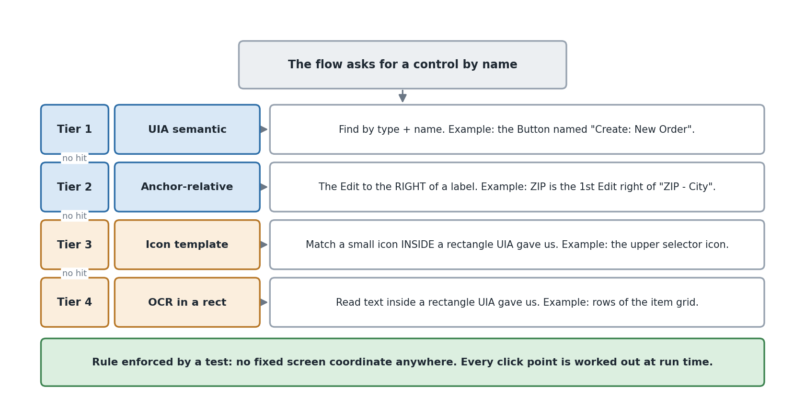
</div>

Each logical control is declared in `src/f2c/ui/selectors.yaml` as an ordered list of strategies. The
resolver tries them in turn and records which one won.

| Tier | How it finds the control |
|---|---|
| **`uia`** | ControlType + Name, scoped to an ancestor. Semantic and stable. |
| **`anchor`** | Geometric: the Edit to the right of, or below, a label. Carries most of the forms, because SWT `Text` widgets have no AutomationId. |
| **`template`** | An icon image matched **inside a UIA-resolved rectangle**. |
| **`ocr`** | Text found inside a UIA-resolved rectangle — the only tier that reaches a custom-drawn canvas. |

**No absolute coordinate exists anywhere in the package.** Every click point is derived at run time
from a resolved rectangle, and `tests/test_no_hardcoded_coords.py` parses the AST of every module to
prove no pointer call receives a numeric literal.

In the recorded run, **237 of 290 resolutions were semantic UIA** and the remaining 53 anchor-relative —
zero template and zero OCR-locator resolutions. The accessibility tree carries almost the whole flow.

</details>

<details>
<summary><b>What recon established about Fakturama 2.2.0</b></summary>

<br>

All of this was read off the live accessibility tree, not assumed:

* The shell is Eclipse/SWT; every composite is `SWT_Window0` with no useful AutomationId.
* Toolbar buttons *do* carry real names (`Create: New Order`, `Save the current contents`), and several
  Edits do too (`Cust.Ref.`, `Discount`, `Total`).
* The left navigation is **not** a tree — it is a pane of plain `Text` controls.
* The record selectors beside *Addresses* and *Items* are unnamed `Image` controls stacked vertically.
  The spec's "upper icon, not the lower green +" is expressed as `pick: topmost` within the smallest
  enclosing composite, and a guard refuses to click if the selector is not above the creation control.
* **Every list is a custom-drawn canvas** — the item grid *and* the address, product and document lists.
  UIA reports their position and nothing else.
* SWT dialogs are child shells of the main window, not desktop siblings.
* One caption can front two fields (`First Name Last Name`, `ZIP - City`).
* **A saved document editor is renamed** — `New Order` becomes `PO000001` — so every selector that
  identifies it by name stops matching at the moment the Order starts to exist. Hence the
  `{order_number}` placeholder mechanism.

</details>

<details>
<summary><b>The Order-first flow, and why long runs survive</b></summary>

<br>

<div align="center">
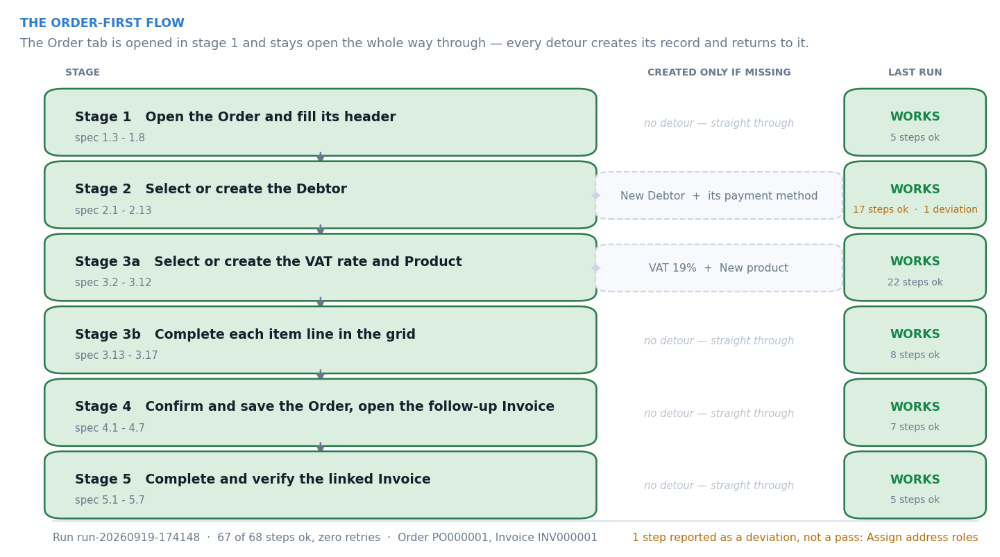
</div>

The Order editor is opened in stage 1 and **stays open**. Every master-data detour opens its own editor
on top of it and returns by clicking the Order's tab, never by re-opening it.

Nearly every failure against the live application has the same shape: a control needs the foreground,
keyboard focus and a settled layout, and if any of the three is not true when a keystroke lands, the
operation does nothing **and says nothing**. `flow.context.StepAttempts` recovers the whole class — it
re-asserts the foreground, throws away cached container elements and runs the step's own recovery.

It is deliberately **opt-in per step**: a body may only be replayed if running it twice is
indistinguishable from running it once. Anything that **creates a record or presses Save** uses the
single-attempt `Ctx.step`, because a repeat would mean a second saved record — the one failure this
automation must never produce.

</details>

<details>
<summary><b>Verification — two independent oracles</b></summary>

<br>

<div align="center">
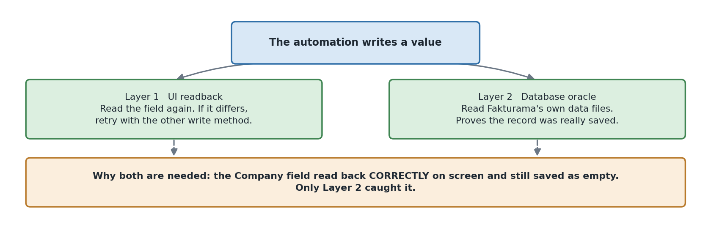
</div>

**UI readback** — every stage verifies its own post-condition, and every write is read back and retried
via the other write path before being accepted.

**Database oracle** — Fakturama 2.2.0 ships **HSQLDB, not H2**, and HSQLDB keeps its data as plain-text
SQL (`Database.script` plus the uncheckpointed `Database.log`). So `verify/db.py` is a parser, not a
JDBC client: no driver, no jar, no file-lock problem, and rows committed since the last checkpoint are
still visible.

This layer earned its place. `ValuePattern.SetValue` updates an SWT widget's displayed text — and the
read-back agrees — without firing the modify listener, so Company, Alias and Country read back
correctly, saved without complaint, and landed in the database as `NULL`. Only a second, independent
oracle could have caught that.

</details>

<details>
<summary><b>Where the flow stops for a human</b></summary>

<br>

It raises `ManualReviewRequired` — with a screenshot, a UIA tree dump and the expectation that failed —
rather than guessing, for:

* ambiguous or conflicting Debtor rows in the address picker;
* multiple or conflicting payment methods with the same name;
* a VAT row whose name, value or e-invoice code disagrees with the required definition;
* a Product that does not reappear in the selector after being saved;
* an Invoice payment method that is not available;
* any totals mismatch between the Order footer and the source image.

</details>

<details>
<summary><b>Bugs this found the hard way</b></summary>

<br>

Each was caught against the live application and is commented at the fix site.

| Symptom | Cause | Fix |
|---|---|---|
| Company, Alias and Country read back correctly, saved without complaint, stored as `NULL` | `ValuePattern.SetValue` does not fire SWT's modify listener | Writes are real key events by default |
| Company saved as `"Northstar Office GmbH\t"` | A commit `{Tab}` is inserted as content by multi-line fields | The generic commit key was removed |
| `Jul 14, 2026` became `Sep 20, 0026` | The date control is segmented and re-parses on every keystroke | A continuous digit run, in the widget's own segment order |
| Clicks on the selector icons did nothing | SWT image buttons swallow a press that arrives with the cursor | The click moves, settles, then presses |
| The automation drove File Explorer | A window-title match — the Explorer tab was titled `fakturama-image-to-cash` | Identification by process + shell class |
| Writes went into an editor that was not on screen | Eclipse parks a background editor's widgets off-screen; they keep answering UIA | The resolver refuses parked controls; `_activate` *proves* arrival |
| The same product appeared on the Order twice | The picker **appends** a line; a retry after a late failure appended a second | `precondition` on the replay harness |
| Step 4.6 could not find the follow-up area | 4.5 leaves Data ▸ Documents in front of the editor, and the saved editor has been renamed | 4.6 activates the Order first; `{order_number}` identifies it |
| A bare `name_contains: "Invoice"` matched the Order's own **"Invoice address"** tab | Too loose a name match | Selectors can declare `name_excludes` |
| A perfect run was reported as needing manual review | The final check looked for the word "invoice"; the OCR'd list renders `INV000001` as `INVOOOOO1` | Rows matched by document number, confusable glyphs folded |

</details>

---

## 🔁 Repeatable runs

The flow **creates master data**, so a second run against the same workspace takes the "already exists"
branch and stops exercising the creation paths. Snapshot a clean workspace once, then restore it before
each run:

```bash
python scripts/snapshot_workspace.py --allow-running   # once, from a clean Fakturama
python scripts/reset_workspace.py                      # before each run
python scripts/reset_workspace.py --launch             # ... and start Fakturama
```

Only `Database/` and `Templates/` are copied, so the workspace may be a drive root, and the current
workspace is always **moved aside, never deleted**.

---

## 🩺 Troubleshooting

| Symptom | Likely cause | What to do |
|---|---|---|
| `f2c` is not recognised | The package was not installed | Run `pip install -e .`, or use `python -m f2c.cli` with `PYTHONPATH=src` |
| `GROQ_API_KEY is not set` | No `.env`, or it is not next to the repo root | Copy `.env.example` to `.env` and fill it in |
| `doctor` says the executable does not exist | `F2C_FAKTURAMA_EXE` is wrong | Point it at the real `Fakturama.exe` |
| `doctor` shows the wrong workspace | `F2C_WORKSPACE` is the install folder | Use the folder Fakturama's **title bar** names, the one holding `Database/` |
| The first run hangs for a minute at "loading EasyOCR models" | The models are downloading (~100 MB) | Wait — it happens once |
| A run stops with `manual-review` | A gate fired on purpose | Read `out/run-*/report.md`; the screenshot and tree dump next to it say exactly what was ambiguous |
| The run creates nothing the second time | Master data already exists | `python scripts/reset_workspace.py` |
| Clicks land in the wrong window | Something stole the foreground mid-run | Leave the machine alone during a run; the harness re-asserts the foreground but cannot fight a user |
| `no OCR engine available` | Neither EasyOCR nor Tesseract is installed | `pip install easyocr`, or install Tesseract and `pip install pytesseract` |

---

## 🗂️ Project layout

```text
run_gui.py                  the desktop front end, without installing the package
src/f2c/
├── models.py               the typed shape of an order — all money is Decimal
├── artifacts.py            the evidence folder: steps, screenshots, reports, live listener
├── cli.py                  run · extract · verify · gui · inspect · resolve · doctor
├── extract/                image → OrderDoc
│   ├── ocr.py              pixels → positioned words (EasyOCR / Tesseract)
│   ├── schema.py           the tool schema the model must fill in
│   ├── llm.py              Groq and Anthropic behind one interface
│   ├── validate.py         the arithmetic gate
│   └── pipeline.py         caching, normalisation, reconciliation
├── gui/                    the desktop window
│   ├── app.py              three panels, one worker thread, one pump
│   ├── theme.py            palette, fonts, ttk styles
│   └── widgets.py          Card · Chip · StageItem · MonoPanel · Metric
├── ui/                     finding and operating controls — no business rules
│   ├── selectors.yaml      115 logical controls, 235 strategies
│   ├── resolver.py         the four-tier engine
│   ├── uia.py              the wrapper over Windows automation
│   ├── grid.py             dialog lists (semantic) and the item canvas (reconstructed)
│   ├── vision_locator.py   pixels, but only inside a UIA-resolved rectangle
│   ├── waits.py            condition-based waiting — no sleep() anywhere
│   ├── app.py              launching, attaching, foreground
│   └── dpi.py              per-monitor DPI awareness
├── flow/                   the five stages of the written procedure
│   ├── context.py          the shared verbs, and the replay harness
│   ├── prerequisites.py    stage 0 — payment method and VAT, with the reason documented
│   ├── order_header.py     stage 1
│   ├── debtor.py           stage 2
│   ├── payment.py vat.py   supporting records
│   ├── product.py items.py stage 3
│   ├── finalize_order.py   stage 4
│   ├── invoice.py          stage 5
│   ├── dialogs.py          the two pickers, and the matching rules
│   └── orchestrator.py     the conductor
└── verify/
    ├── ui_readback.py      read the screen back
    └── db.py               read Fakturama's own data files (HSQLDB, parsed)

scripts/                    snapshot · reset · capture_demo · record_screen · annotate · build_*
docs/                       diagrams/ · screenshots/ · recording/
tests/                      155 tests, no Fakturama needed
```

---

## 🧪 Tests

```bash
python -m pytest -q      # 155 passed
```

Pure logic only — **no UI required, nothing installed, nothing launched.** They cover extraction
normalisation and reconciliation (including deliberately corrupted totals), the exact-match and
VAT-reuse decision rules, clipped-column and OCR-confusable matching, the anchor-relative geometry,
grid addressing, locale-tolerant formatting, the replay harness, the selector registry's integrity
(every logical name used by the flow exists; every scope resolves; pixels are never the first
strategy), and the no-hardcoded-coordinates rule.

Several exist because they caught real mistakes: a blanket prefix rule that would have matched `Berlin`
against `Berlin-Mitte`, an OCR fold that had to be proven not to merge distinct SKUs, and the
document-row classifier that reported a perfectly good run as needing manual review.

---

## ⚠️ Known gaps

These are stated plainly rather than hidden — each one is recorded in the run report too.

1. **A differing delivery address is not created as a second address.** The sample's delivery address
   differs from billing; only the Main address is created and given the Invoice role. The flow records
   this as a **deviation**, not a success.
2. **Address roles** are set through this version's address-type control; when it cannot be driven, the
   Main address keeps Fakturama's defaults and the step is reported as `skipped`, not `ok`.
3. **The OCR drops the dot in the e-mail address.** It reads `martaklein@example.test` for a printed
   `marta.klein@example.test`, and the model — correctly forbidden from inventing a value — transcribes
   what it was given, so the Debtor is created with the shortened address. The fix belongs in the OCR
   stage, not in a looser prompt.
4. **Alias and Country intermittently need a second write.** The read-back catches it and retries, but
   the underlying widget event has not been found.
5. **The product selector's SKU column cannot be reconstructed** from the canvas. A documented, narrow
   fallback accepts the single row returned by an exact-SKU search when its name also matches the
   extracted description — and records in the report that it did so.
6. **Icon templates are not committed** — capture them per machine with `f2c capture-icon`. Every
   template selector has a UIA fallback, so their absence degrades rather than breaks a run.
7. **One document.** The extraction has been proven against one order image.

---

## ⏳ If I had 3 more hours

**A second and third order image.** The flow is complete; what is *not* known is how much of the
extraction accuracy is genuine and how much is this one document. A different layout, a gross-priced
document and a multi-VAT document would teach me more than any further work on the happy path.

**Resume from a failed step.** `FlowState` already records what the run created; a run that fails at
stage 4 should restart without re-creating the Debtor and the Products.

**The e-mail dot.** A confidence-weighted second OCR pass over the regions that scored below threshold,
handed to the model as "these characters are uncertain" — which keeps *transcribe, never compute* intact
while giving the model something better to transcribe.

**Remove the last OCR dependency from the write path.** Item lines are typed into real SWT cell editors
and verified there, but *finding* the cell still needs the reconstructed canvas geometry.

**Create the differing delivery address** — the one part of the written procedure that is currently
reported as a deviation rather than performed.

---

<div align="center">

<sub>Built for the TJM Labs automation assessment · verified against Fakturama 2.2.0 on Windows 11</sub>

</div>
